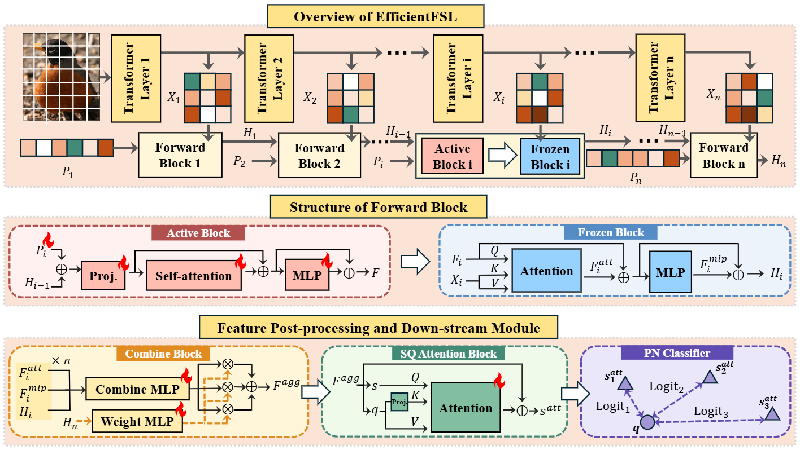

## EfficientFSL: Enhancing Few-Shot Classification via Query-Only Tuning in Vision Transformers

Official implementation of **EfficientFSL: Enhancing Few-Shot Classification via Query-Only Tuning in Vision Transformers** (AAAI 2026).

**Authors:** Wenwen Liao, Hang Ruan, Jianbo Yu, Bing Song, Yuansong Wang, Xiaofeng Yang  
**arXiv:** [arXiv:2601.08499](https://arxiv.org/abs/2601.08499)  
**DOI:** [10.48550/arXiv.2601.08499](https://doi.org/10.48550/arXiv.2601.08499)

> **Abstract.** Large models such as Vision Transformers (ViTs) have demonstrated remarkable superiority over smaller architectures like ResNet in few-shot classification, owing to their powerful representational capacity. However, fine-tuning such large models demands extensive GPU memory and prolonged training time, making them impractical for many real-world low-resource scenarios. To bridge this gap, we propose EfficientFSL, a query-only fine-tuning framework tailored specifically for few-shot classification with ViT, which achieves competitive performance while significantly reducing computational overhead. EfficientFSL fully leverages the knowledge embedded in the pre-trained model and its strong comprehension ability, achieving high classification accuracy with an extremely small number of tunable parameters. Specifically, we introduce a lightweight trainable Forward Block to synthesize task-specific queries that extract informative features from the intermediate representations of the pre-trained model in a query-only manner. We further propose a Combine Block to fuse multi-layer outputs, enhancing the depth and robustness of feature representations. Finally, a Support-Query Attention Block mitigates distribution shift by adjusting prototypes to align with the query set distribution. With minimal trainable parameters, EfficientFSL achieves state-of-the-art performance on four in-domain few-shot datasets and six cross-domain datasets, demonstrating its effectiveness in real-world applications.

<p align="center">
    
</p>

---

## Installation

This codebase has been tested with the following configuration (other versions may also work):

- Python 3.9
- CUDA 11.x
- PyTorch ≥ 1.9.0

You can recreate the environment via Conda:

```bash
conda env create -f environment.yml
conda activate efficientfsl
```

or install from `requirements.txt` using pip as you prefer.

---

## Datasets

EfficientFSL follows the dataset preparation of **SemFew**. Please refer to the SemFew repository for detailed instructions:

- SemFew repo: https://github.com/zhangdoudou123/SemFew

After preparing the datasets according to SemFew, place them under the `dataset/` directory of this project, following the same folder structure. This will enable direct loading through the provided dataloaders.

---

## Pretrained ViT Checkpoints

Download the pre-trained ViT-B/16 checkpoint (ImageNet-21k) and put it under `ckpt/21k.npz`:

- ViT-B/16 (ImageNet-21k): https://storage.googleapis.com/vit_models/imagenet21k/ViT-B_16.npz

You may also use other compatible ViT checkpoints as long as they follow the same timm model interface.

---

## Training & Evaluation

We provide a simple script to run EfficientFSL on few-shot classification benchmarks.

The main entry for few-shot training is [trainfs.py](trainfs.py), and a convenience script [run.sh](run.sh) is provided. The script format is:

```bash
bash run.sh GPU_ID EXP_NAME DATASET SHOT
```

For example, to run a demo experiment on mini-ImageNet with 1-shot on GPU 1:

```bash
bash run.sh 1 demo mini-ImageNet 1
```

Key arguments inside `run.sh` / `trainfs.py` include:

- `--dataset`: dataset name (e.g., `mini-ImageNet`, `cifar`, etc.)
- `--ckpt`: ViT checkpoint type (e.g., `vit_21k`)
- `--method`: must be set to `efficientfsl` in this codebase
- `--shot`: number of shots per class in the few-shot setting

Logs and checkpoints will be saved under the `log/` directory with the experiment name and hyper-parameters encoded in the path.

---

## Citation

If you find EfficientFSL useful in your research, please consider citing our AAAI 2026 paper:

```bibtex
@article{liao2026efficientfsl,
  title   = {EfficientFSL: Enhancing Few-Shot Classification via Query-Only Tuning in Vision Transformers},
  author  = {Liao, Wenwen and Ruan, Hang and Yu, Jianbo and Song, Bing and Wang, Yuansong and Yang, Xiaofeng},
  journal = {arXiv preprint arXiv:2601.08499},
  year    = {2026},
  doi     = {10.48550/arXiv.2601.08499}
}
```

---

## License

This project is released under the [MIT License](LICENSE).

---

## Acknowledgements

This implementation is inspired by and built upon prior work on parameter-efficient tuning and few-shot learning, including but not limited to:

- SemFew: https://github.com/zhangdoudou123/SemFew
- VPT: https://github.com/KMnP/vpt
- ConvPass: https://github.com/JieShibo/PETL-ViT
- SSF: https://github.com/dongzelian/SSF
- SynQT: https://github.com/taolinzhang/SynQT

We thank the authors of these projects for making their code publicly available.
